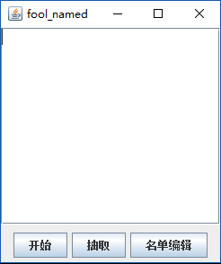
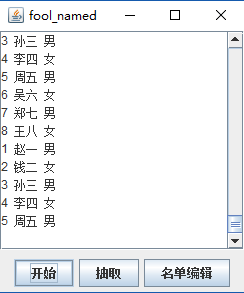
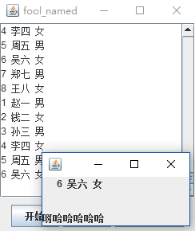
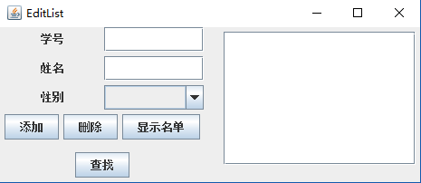
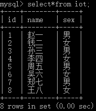

# fool_named

Now the problem below has been solved.
The solution is that when you want to control thread B in thread A, you must define them beside the constructor.
And this version is wrote for mysql, you can't run it everywhere unless you have a online server.
----------------------------------------------I am the Luxuriant split line----------------------------------------------------
This application is wrote for teachers who need to call the roll in a special way.
The effect what I want is that When you click the button "开始", The list in textarea start rolling, and then you click the button "抽取", the list stop rolling, and the last name is the fool.
But there are something wrong with the "Thread t1" and "Thread t2", I need t2 to stop t1, but don't know how. I have tried several ways just like "use boolean variate" and "use t1.stop() in t2" , but failed.
Now I'm trying all the time, and also need you to help me.
----------------------------------------------I am the Luxuriant split line----------------------------------------------------
Here is instruction:

1.MainWindow

2.Click the "开始" button

3.Click the "抽取" button

4.Click the "名单编辑" button

5.Data in my offline MySQL Database

